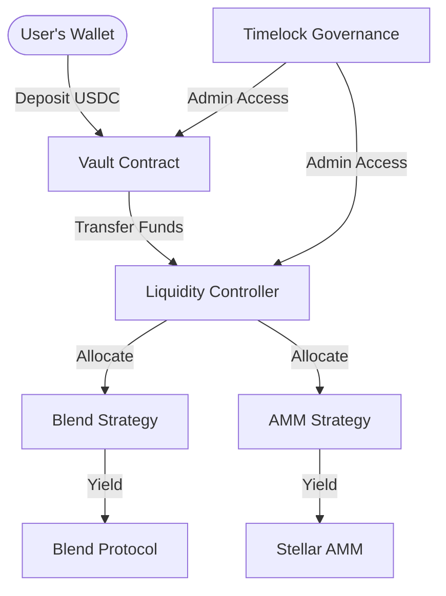

# 💧 Liquid Pool | Soroban Liquidity Optimizer

Maximize your yield on the Stellar network with our automated, trustless liquidity pool optimizer. Built with state-of-the-art **Soroban** smart contracts and a premium **Next.js** dashboard.

---

## 🛠️ Tech Stack

<div align="center">
  
  
  
  
  
</div>

---

## 🚀 Overview

Liquid Pool is a DeFi yield optimizer that manages liquidity across various Soroban-based protocols. Users deposit **USDC** into the Vault, which sends it to a **Controller**. The Controller then dynamically allocates those assets into different Yield Strategies (e.g., Lending on Blend, LP on AMMs) periodically based on the highest available APY.

### Key Features
- **Automated Rebalancing**: The Controller monitors yields and moves capital to the most profitable strategies.
- **Protocol Integration**: Supports **Blend Protocol** lending and **Stellar Native AMMs**.
- **Transparency**: Fully audited-style Soroban smart contracts with a dedicated Timelock for governance.
- **Premium UI**: High-fidelity dashboard for tracking TVL, APY, and managing deposits with **Freighter Wallet**.

---

## 🏗️ Architecture



---

## 📍 Deployed Contracts (Testnet)

| Contract | Contract ID |
| :--- | :--- |
| **Vault** | `CCDL63P3AHW6QGGY7JMEQ2D7IJX4Y4F5R6CO7HMMFWWVGSZMHAOXERG7` |
| **Controller** | `CCUUAKC45XN2OCALQCLAHFNC3EBR7L6N4N5V6LS5MRBB7E6U4S6ISWXT` |
| **Timelock** | `CBGMEJQSDV3MJMDBDOGZQ7O7VGTRXCZJLOBJXKDL6VTYOXFKDTXGYE5N` |
| **Blend Strategy** | `CBDJVNZQEOAKV465J4V7W2YOXEDLF3VRHIN4C4AIP6RO7T7B22O5BCEV` |
| **AMM LP Strategy** | `CAOYDQYAR2R2U3EF57SHM4VEU2SRSDYZXXHY42OA5ZBWI324GDZWS6AL` |

---

## 📦 Getting Started

### 1. Requirements
- [Stellar CLI](https://developers.stellar.org/docs/build/smart-contracts/getting-started/setup)
- [Rust](https://www.rust-lang.org/tools/install)
- [Node.js v20+](https://nodejs.org/)
- [Freighter Wallet Extension](https://www.freighter.app/)

### 2. Install Dependencies
```bash
# Install contract workspace dependencies
cargo build --target wasm32v1-none --release

# Install frontend dependencies
cd frontend
npm install
```

### 3. Run Locally
```bash
# Start the dashboard
npm run dev
```

---

## ⚖️ License
Distributed under the MIT License.

---

<div align="center">
  Built with ❤️ by <b>surf3rr</b> on <b>Stellar Soroban</b>
</div>
